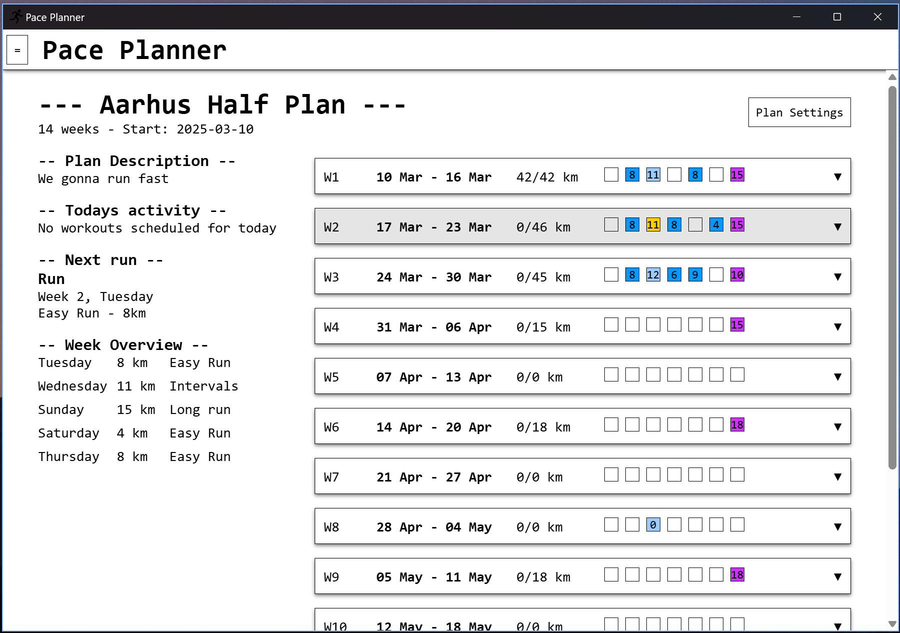

# Pace Planner

Desktop application for managing running plans. The goal is to provide a simple and easy-to-use interface for creating and managing running plans. The application will allow users to create custom plans, add workouts, and track progress.

## Installation

Check out the associated landing page [here](https://bundgaard1.github.io/pace_planner/) for installation links.

## Contributing

If you want to contribute, feel free to fork the repository and submit a pull request. I'm open to any suggestions or improvements.

The application is built using [Wails](https://wails.io/), which utilizes Go for the backend, and this project uses Svelte for the frontend.

